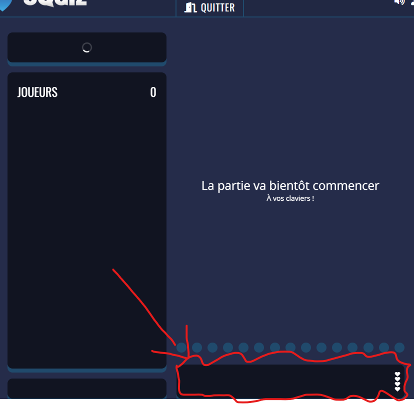

# Project README

## Update
This has been patched and requires an update.

## Overview
This project is a bot designed to play [Squiz.gg](https://squiz.gg) using the OpenAI API.

## Installing Dependencies

To get started, you'll need to install some dependencies. Open your terminal or command prompt and run the following commands:

```sh
pip install undetected-chromedriver
pip install selenium
```


